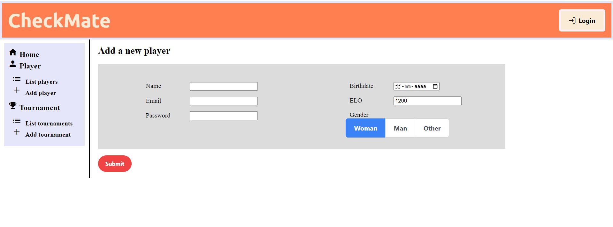
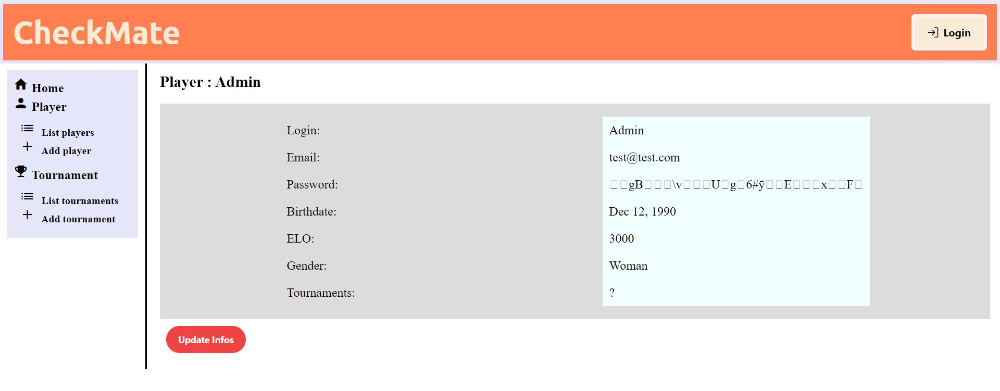

# Chess Tournaments Application
> **Chess Tournaments Application with `ASP.NET` and `Angular`**  

This a practice project for my Angular and C# courses.

## Description:  
Chess Tournament Application with Responsive UI with Angular. 
Connects to local Database with Entity Framework. 

Current main tables:

`Player`  
 - List + Details (+ Update ongoing)
 - Add  
 
`Tournament`  
 - List + Details (+ Update ongoing)
 - Add
 
There is an accordion nav on the left.   
You can login to the app with the button on the right, and the login button disappears (I planned on adding more validators).   
The passwords are hashed by a function in the AuthService in ASP.NET and uses Jwt to validate tokens.

Forms are sent with observables by the service to the backend in ASP.NET.

  

## Technologies used:
**C#, ASP.NET, Angular, Typescript, API, Entity, HTML, CSS, JS, Microsoft SQL SMS, Swagger, Jwt**

Main libraries:   
`ASP.NET`
 - Microsoft.AspNetCore.Authentication.jwt 
 - Microsoft.EntityFrameworkCore
 - Microsoft.EntityFrameworkCore.SqlServer
 - Microsoft.EntityFrameworkCore.Tools 
 - Swashbuckle.AspNetCore  
 - LinQ

 `Angular`
 - FormsModule  
 - ReactiveFormsModule  
 - HttpClientModule  
 - PrimeNG  
 - Ng2-Charts

## Features to improve:

This project is on hiatus and I am not planning on finishing it at this time.   
- Finish the Update pages
- A registration system
- Start the actual tournament round 
- Display results
- Add rules
- Simulate rounds with player ELO  
- ..  

## Installation  
`ASP.NET`   

- Make sure to download and install the Nuget Packages  
- Uncomment the send email features in the controllers  
- Add your connectionStrings data in the appsettings.Developpment.json  
- Change your email and password in the SMTP in appsettings.json  
- Add your signature in the appsettings.json  
- (Build your admin entity directly in the ChessContext)  

`Angular`   

- Make sure to download and install node.js and the above libraries
- Import the libraries in the app.module.ts imports
- Open a new terminal  
&nbsp;&nbsp;&nbsp;&nbsp; - Enter: 'npm install'  
&nbsp;&nbsp;&nbsp;&nbsp; - Enter: 'ng serve'  

Make sure to read the specific readmes and the docs if you're not familiar with the technologies
