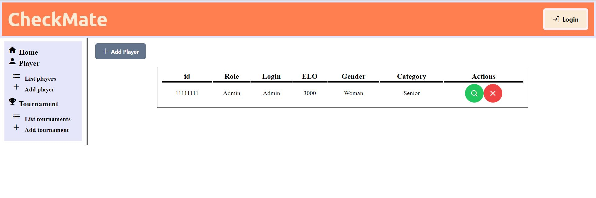

# Chess Tournaments Application
> **Chess Tournaments Showcase Application with `ASP.NET` and `AngularJS`**  

This a showcase project for my Angular and C# courses.

## Description:  
Chess Tournament Application with Responsive UI with AngularJS (+ accordion menu). 
Connects to local Database with Entity Framework.
Current main tables:

 - Player
 - Tournament  
 
You can login to the app (only the admin adds users) and the login button disappears.  
View list, add to table, remove from table, view details of players or tournaments. (Update ongoing)  

  

## Technologies used:
**C#, ASP.NET, AngularJS, Typescript, API, Entity, HTML, CSS, JS, Microsoft SQL SMS, Swagger**

Main libraries:   
`ASP.NET`
 - Microsoft.AspNetCore.Authentication.jwt 
 - Microsoft.EntityFrameworkCore
 - Microsoft.EntityFrameworkCore.SqlServer
 - Microsoft.EntityFrameworkCore.Tools 
 - Swashbuckle.AspNetCore  
 - LinQ

 `AngularJS`
 - FormsModule  
 - ReactiveFormsModule  
 - HttpClientModule  
 - PrimeNG  
 - Ng2-Charts

## Features to improve:

This project is on hiatus and I am not planning on finishing it at this time.   
- Finish the Update pages
- A registration system
- Start the actual tournament round 
- Display results
- Add rules
- Simulate rounds with player ELO

## Installation
`ASP.NET`  
Make sure to download and install the Nuget Packages  
Uncomment the send email features in the controllers  
Add your connectionStrings data in the appsettings.Developpment.json  
Change your email and password in the SMTP in appsettings.json  
Add your signature in the appsettings.json  
Build your admin entity directly in the ChessContext  
`AngularJS`  
Make sure to download and install node.js and the libraries  
npm install  
ng serve
